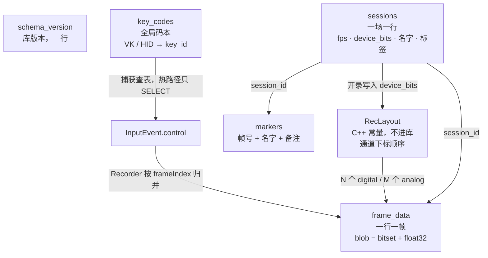
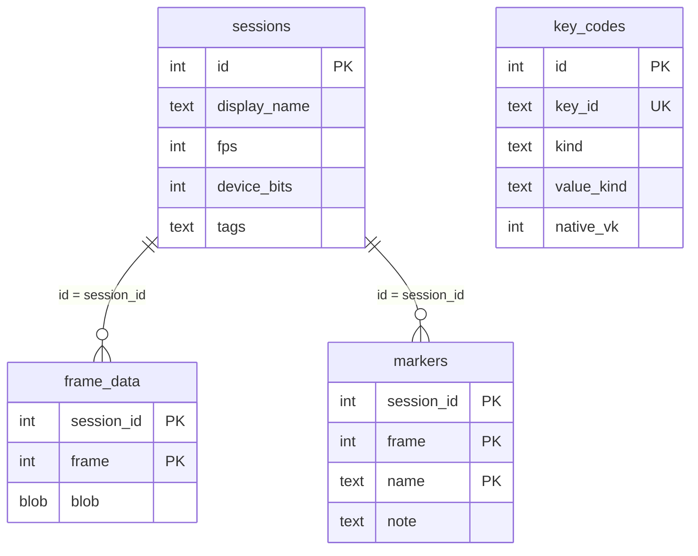

# 数据库建表

一份 SQLite：`data.db`，和 exe 同目录。实现：`PeripheralCapturer/storage/Database.cpp`。

```text
key_codes          全局码本（VK → key_id）
sessions           一场一行：fps + device_bits
   ├── frame_data  录制本体：一行一帧（frame + blob）
   └── markers     同步点（frame + name + note）
```

本场通道顺序由 `RecLayout` 与 `sessions.device_bits` 决定。

打开时 `schema_version` 须与程序一致（当前 `4`）；不一致则重建空库。

## 表怎么协作

库表只有外键两条：`frame_data`、`markers` 都挂在 `sessions.id` 上。码本和通道顺序不靠外键，靠 `key_id` 字符串和 `device_bits`。





读写顺序：

1. **开库**：核对 `schema_version`，种子写入 `key_codes`（`origin=builtin`）。
2. **开录**：`INSERT sessions`（`fps`、`device_bits`）。通道宽度用 `RecLayout` 按 bits 算出，不再往库里插通道行。
3. **录着**：捕获用 `key_codes` 把 VK 变成 `key_id`；Recorder 把该帧的按下位和轴值打进 `frame_data.blob`；热键 marker 进 `markers`。
4. **停录**：回填 `sessions.end_time`、`total_frames`。
5. **检查 / 回放**：读一场 `sessions` → 用 `device_bits` + `RecLayout` 知道 blob 每一位是哪个 `key_id` → 抽 `frame_data` / `markers`。皮肤来自 Profile JSON，不进这几张表。
6. **删除**：`DELETE FROM sessions`，帧和 marker 级联掉；`key_codes` 留下。

---

## 1. `schema_version`

```sql
CREATE TABLE schema_version (
    version INTEGER NOT NULL
);
```

---

## 2. `key_codes`（全局码本）

捕获查表、码本页用。

```sql
CREATE TABLE key_codes (
    id INTEGER PRIMARY KEY AUTOINCREMENT,
    key_id TEXT NOT NULL UNIQUE,
    kind TEXT NOT NULL,
    value_kind TEXT NOT NULL,
    range_min REAL,
    range_max REAL,
    native_usage_page INTEGER,
    native_usage INTEGER,
    native_vk INTEGER,
    default_label TEXT NOT NULL,
    origin TEXT NOT NULL DEFAULT 'user'
);

CREATE INDEX idx_key_codes_native_vk ON key_codes(kind, native_vk);
```

| 列 | 约定 |
| --- | --- |
| `key_id` | `w`、`mouse-left`、`pad-lt`。小写、字母数字和 `-` |
| `kind` | `keyboard` / `mouse` / `gamepad` / `other` |
| `value_kind` | `digital` 或 `analog` |
| `range_min` / `range_max` | analog：扳机 `0..1`，摇杆 `-1..1` |
| `native_vk` | Win32 VK；手柄面键可空 |
| `origin` | `builtin` / `user` / `capture`。升级只 INSERT OR IGNORE builtin |

热路径不 INSERT。

---

## 3. `sessions`（一场一行）

```sql
CREATE TABLE sessions (
    id INTEGER PRIMARY KEY AUTOINCREMENT,
    display_name TEXT NOT NULL,
    start_time INTEGER NOT NULL,
    end_time INTEGER,
    fps INTEGER NOT NULL,
    total_frames INTEGER NOT NULL DEFAULT 0,
    device_bits INTEGER NOT NULL,
    note TEXT NOT NULL DEFAULT '',
    tags TEXT NOT NULL DEFAULT ''
);

CREATE INDEX idx_sessions_start ON sessions(start_time DESC);
```

| 列 | 约定 |
| --- | --- |
| `id` | 认这一场 |
| `start_time` / `end_time` | Unix 毫秒；录制中 `end_time` 为 NULL |
| `fps` | 开录写入 |
| `total_frames` | 停录回填，等于该场 `frame_data` 行数 |
| `device_bits` | bit0 键盘、bit1 鼠标、bit2 XInput。配置窗勾选，开录写入 |
| `tags` | 逗号分隔，如 `aim,warmup` |

---

## 4. `frame_data`（录制本体）

```sql
CREATE TABLE frame_data (
    session_id INTEGER NOT NULL,
    frame INTEGER NOT NULL,
    blob BLOB NOT NULL,
    PRIMARY KEY (session_id, frame),
    FOREIGN KEY (session_id) REFERENCES sessions(id) ON DELETE CASCADE
);
```

一行一帧。`blob` 宽度由 `device_bits` 决定（小端）：

```text
[ bitset  ceil(N/8) 字节 ][ float32 × M ]
     N = RecLayout::digitalCount(bits)     M = RecLayout::analogCount(bits)
```

顺序：键盘数字 → 鼠标键 → 手柄面键；然后鼠标 dx/dy → 手柄轴。未勾的设备整段不出现。

内存攒批：满约 1MB 或 2048 帧（先到为准）再一次事务 `INSERT`。当前每帧只有几十字节，实际是帧数上限先触发（60fps 大约半分钟）。

```sql
SELECT blob FROM frame_data WHERE session_id = ? AND frame = ?;
```

---

## 5. `markers`

```sql
CREATE TABLE markers (
    session_id INTEGER NOT NULL,
    frame INTEGER NOT NULL,
    name TEXT NOT NULL,
    note TEXT NOT NULL DEFAULT '',
    PRIMARY KEY (session_id, frame, name),
    FOREIGN KEY (session_id) REFERENCES sessions(id) ON DELETE CASCADE
);
```

`name` 录制时写入（如 `sync`）。`note` 事后在录制库改。

---

## 6. 外键

`PRAGMA foreign_keys = ON`。`DELETE FROM sessions` 级联帧和 marker。码本保留。
